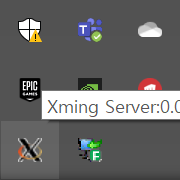
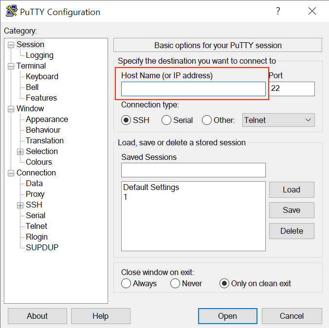
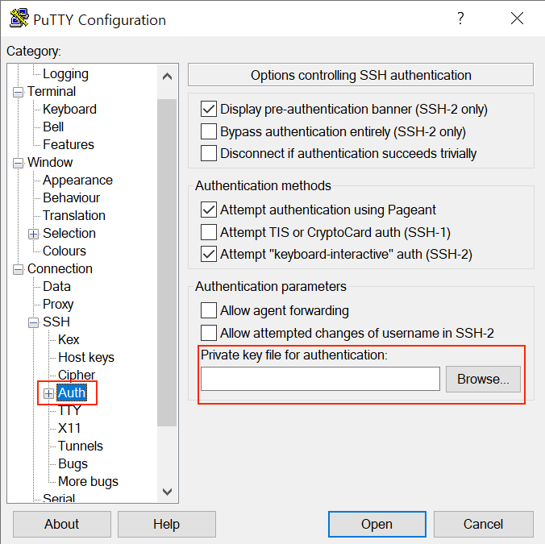
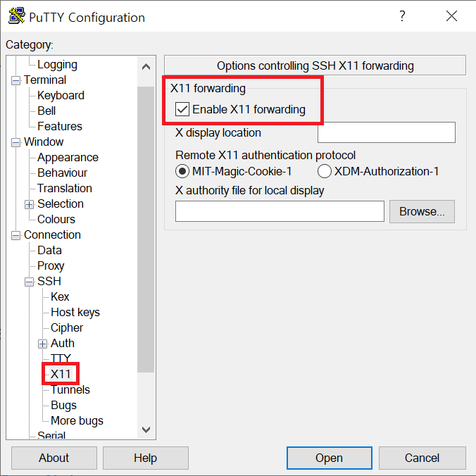
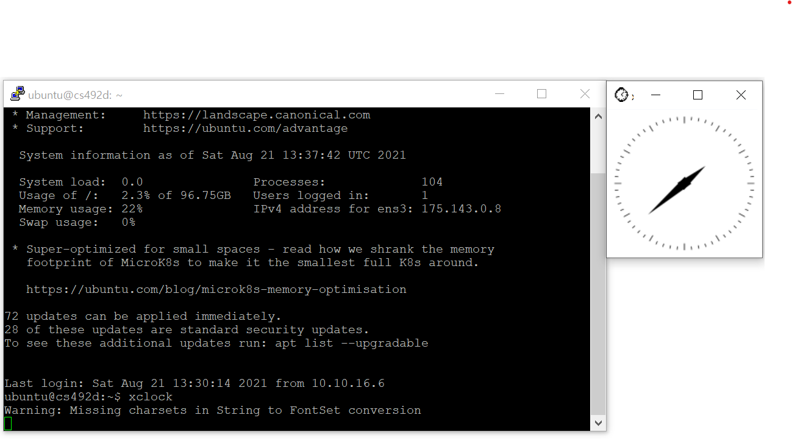

# cs492d-2021-fall-assignments
### Table of contents

- [MAC](#mac)
- [Windows](#windows)

## MAC

### 1. Install Xquartz 

* Install Xquartz in https://www.xquartz.org/releases/XQuartz-2.7.11.html
*  Open a terminal and run `defaults write org.xquartz.X11 enable_iglx -bool true` and then re-open Xquartz

### 2. Edit the configuration 

* Edit the configuration in ` /etc/ssh/ssh_config` and `/etc/ssh/sshd_config` 

   `$ sudo vi /etc/ssh/ssh_config`
   ```shell
   ForwardAgent yes
   ForwardX11 yes
   ForwardX11Trusted yes
   ```

   

   `$ sudo vi /etc/ssh/sshd_config`
   ```shell
   X11Forwarding yes
   ```

   

### 3. Connect to the Kcloud using -XY option
`$ ssh -XY -i {PEM_KEY} ubuntu@{IP_ADDRESS} -p 22`
### 4. Go back to step 2 and set the configuration of the server in the same way.
```shell
$ sudo vi /etc/ssh/ssh_config 
$ sudo vi /etc/ssh/sshd_config
```
### 5. Install libraries
Run:

```shell
wget https://raw.githubusercontent.com/63days/cs492-2021-fall-assignments/main/install_essential.sh?token=AJAJYDVDUO5LFZQHNTMRJYDBFIVTY -O install_essential.sh && sh install_essential.sh
```
For test, run ` $ xclock `

You should be able to see a GUI clock.


## Windows
### 1. Install XMing
* Install Xming in https://sourceforge.net/projects/xming/ (Just keep pressing the next.)

* After the installation, check Xming is running.


### 2. Install & Setup PuTTY

* Install PuTTY in https://www.chiark.greenend.org.uk/~sgtatham/putty/latest.html 
* Run PuTTY and enter the IP Address



* Go to SSH/Auth menu and load a private key (*Refer to https://docs.oracle.com/en/cloud/paas/goldengate-cloud/tutorial-change-private-key-format/ if you have to change the format of the ssh private key.*)



* Go to X11 menu and check "Enable X11 forwarding".



### 3. Edit the configuration
After conecting to the server,
* Edit the configuration in ` /etc/ssh/ssh_config` and `/etc/ssh/sshd_config` 

   `$ sudo vi /etc/ssh/ssh_config`
   ```shell
   ForwardAgent yes
   ForwardX11 yes
   ForwardX11Trusted yes
   ```

   

   `$ sudo vi /etc/ssh/sshd_config`
   ```shell
   X11Forwarding yes
   ```

   

### 4. Install libraries
Run:

```shell
wget https://raw.githubusercontent.com/63days/cs492-2021-fall-assignments/main/install_essential.sh?token=AJAJYDVDUO5LFZQHNTMRJYDBFIVTY -O install_essential.sh && sh install_essential.sh
```
For test, run ` $ xclock `

You should be able to see a GUI clock.



