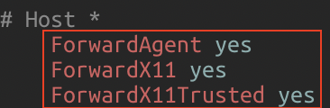
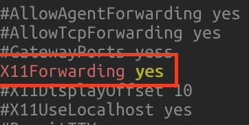
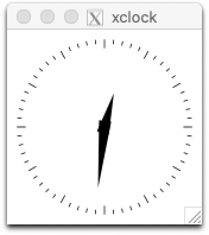

# cs492d-2021-fall-assignments

## MAC
### 1. Install Xquartz 

* Install Xquartz in https://www.xquartz.org/releases/XQuartz-2.7.11.html
*  Open a terminal and run `defaults write org.xquartz.X11 enable_iglx -bool true` and then re-open Xquartz

### 2. Edit the configuration 

* Edit the configuration in ` /etc/ssh/ssh_config` and `/etc/ssh/sshd_config` 

   `$ sudo vi /etc/ssh/ssh_config`
   ```shell
   ForwardAgent yes
   ForwardX11 yes
   ForwardX11Trusted yes
   ```

   

   `$ sudo vi /etc/ssh/sshd_config`
   ```shell
   X11Forwarding yes
   ```

   

### 3. Connect to the Kcloud using -XY option
`$ ssh -XY -i {PEM_KEY} ubuntu@{IP_ADDRESS} -p 22`
### 4. Go back to step 2 and set the configuration of the server in the same way.
```shell
$ sudo vi /etc/ssh/ssh_config 
$ sudo vi /etc/ssh/sshd_config
```
### 5. Install libraries
Run:

```shell
wget https://raw.githubusercontent.com/63days/cs492-2021-fall-assignments/main/install_essential.sh?token=AJAJYDVDUO5LFZQHNTMRJYDBFIVTY -O install_essential.sh
```
For test, run ` $ xclock `

You should be able to see a GUI watch.




